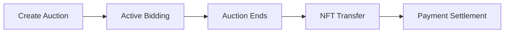

# NFT Auction System - Engineering Documentation

## Overview

The NFT Auction system is a decentralized auction platform built on Ethereum that allows users to create and participate in NFT auctions with support for both ETH and ERC20 token payments. The system uses Chainlink price feeds for accurate price conversion between different tokens.

## Architecture

### Contract Structure

```
NftAuction (Upgradeable)
├── Initializable (OpenZeppelin)
├── UUPSUpgradeable (OpenZeppelin)
└── IERC721Receiver (OpenZeppelin)
```

### Key Components

1. **Auction Struct**: Core data structure storing auction information
2. **Price Feeds**: Chainlink integration for token price conversion
3. **Admin System**: Role-based access control for auction creation
4. **Upgradeable Pattern**: UUPS proxy for contract upgradeability

## Core Features

### 1. Multi-Token Support
- **ETH Bidding**: Native cryptocurrency payments
- **ERC20 Token Bidding**: Support for any ERC20 token
- **Price Conversion**: Chainlink oracles for accurate pricing

### 2. Auction Lifecycle



### 3. Upgradeability
- UUPS Proxy Pattern
- Admin-controlled upgrades
- State preservation across upgrades

## Contract Details

### Data Structures

#### Auction Struct
```solidity
struct Auction {
    address seller;           // Auction creator
    address nftContract;      // NFT contract address
    uint256 tokenId;          // NFT token ID
    uint256 duration;         // Auction duration in seconds
    uint startPrice;          // Minimum bid price
    uint startTime;           // Auction start timestamp
    bool ended;               // Auction ended flag
    address highestBidder;    // Current highest bidder
    uint256 highestBid;       // Current highest bid amount
    address tokenAddress;     // Payment token (0x0 for ETH)
}
```

### State Variables

```solidity
mapping(uint256 => Auction) public auctions;              // Auction ID => Auction
uint256 public nextAuctionId;                             // Auto-incrementing ID
address public admin;                                      // Admin address
mapping(address => AggregatorV3Interface) public priceETHFeed; // Token price feeds
```

## Function Reference

### Admin Functions

#### `initialize()`
- **Purpose**: Initialize contract (called once after deployment)
- **Access**: Public (initializer)
- **Actions**: Sets deployer as admin

#### `setPriceETHFeed(address tokenAddress, address _priceETHFeed)`
- **Purpose**: Configure Chainlink price feed for a token
- **Parameters**:
  - `tokenAddress`: Token to set price feed for (0x0 for ETH)
  - `_priceETHFeed`: Chainlink aggregator address
- **Access**: Public (should be admin-only in production)

#### `createAuction(uint256 _duration, uint256 _startPrice, address _nftAddress, uint _tokenId)`
- **Purpose**: Create a new NFT auction
- **Requirements**:
  - Caller must be admin
  - Duration > 10 seconds
  - Start price > 0
  - NFT must be approved for transfer
- **Actions**:
  - Transfers NFT to contract
  - Creates auction record
  - Increments auction ID

### User Functions

#### `placeBid(uint _auctionId, uint256 _amount, address _tokenAddress)`
- **Purpose**: Place a bid on an auction
- **Parameters**:
  - `_auctionId`: Auction to bid on
  - `_amount`: Bid amount (in tokens or wei)
  - `_tokenAddress`: Payment token (0x0 for ETH)
- **Requirements**:
  - Auction must have started
  - Auction must not have ended
  - Bid must be higher than current highest bid
- **Actions**:
  - Validates bid value using price feeds
  - Refunds previous highest bidder
  - Updates auction state
  - Transfers payment tokens

#### `endAuction(uint256 _auctionId)`
- **Purpose**: Finalize auction and transfer assets
- **Requirements**:
  - Auction must not be already ended
  - Auction duration must have elapsed
- **Actions**:
  - Transfers NFT to highest bidder
  - Transfers payment to seller
  - Marks auction as ended

### View Functions

#### `getLChainlinkDataFeedLatestAnswer(address tokenAddress)`
- **Purpose**: Get current price from Chainlink oracle
- **Returns**: Latest price for the token
- **Use**: Internal price conversion calculations

## Auction Flow

### Creating an Auction

```javascript
// 1. Approve NFT transfer
await nftContract.approve(auctionContract.address, tokenId);

// 2. Create auction
await auctionContract.createAuction(
  duration,     // e.g., 86400 (24 hours in seconds)
  startPrice,   // e.g., ethers.parseEther("0.1")
  nftAddress,
  tokenId
);
```

### Placing Bids

**ETH Bid:**
```javascript
await auctionContract.placeBid(
  auctionId,
  0,              // Amount ignored for ETH
  ethers.ZeroAddress,
  { value: ethers.parseEther("0.2") }
);
```

**ERC20 Bid:**
```javascript
// 1. Approve ERC20 transfer
await erc20Token.approve(auctionContract.address, amount);

// 2. Place bid
await auctionContract.placeBid(
  auctionId,
  amount,
  erc20Token.address
);
```

### Ending Auction

```javascript
// After auction duration has passed
await auctionContract.endAuction(auctionId);
```

## Price Feed Integration

### Chainlink Setup

Price feeds must be configured for each supported token:

```javascript
// Set ETH/USD price feed (Sepolia testnet)
await auctionContract.setPriceETHFeed(
  ethers.ZeroAddress,
  "0x694AA1769357215DE4FAC081bf1f309aDC325306"
);

// Set USDC/USD price feed
await auctionContract.setPriceETHFeed(
  usdcAddress,
  "0xA2F78ab2355fe2f984D808B5CeE7FD0A93D5270E"
);
```

### Price Calculation

Bids are converted to a common value for comparison:

```
bidValue = bidAmount × tokenPrice
```

This allows fair comparison between ETH and ERC20 bids.

## Deployment

### Prerequisites

1. Hardhat development environment
2. OpenZeppelin contracts
3. Chainlink contracts
4. Deployment account with testnet/mainnet ETH

### Deployment Script

Located in `deploy/01_deploy_nft_auction.js`:

```javascript
const nftAuction = await upgrades.deployProxy(
  NftAuction,
  [],
  { initializer: "initialize" }
);
```

### Deployment Commands

```bash
# Deploy to local network
npx hardhat deploy

# Deploy to Sepolia testnet
npx hardhat deploy --network sepolia

# Verify contract
npx hardhat verify --network sepolia <PROXY_ADDRESS>
```

## Upgrade Process

### Deploying Upgrades

1. Create new implementation contract (e.g., `NftAuctionV2.sol`)
2. Deploy upgrade:

```javascript
const upgraded = await upgrades.upgradeProxy(
  proxyAddress,
  NftAuctionV2
);
```

3. Verify upgrade succeeded
4. Test new functionality

### Upgrade Safety

- ✅ Can add new state variables
- ✅ Can add new functions
- ✅ Can modify function logic
- ❌ Cannot change existing state variable types
- ❌ Cannot reorder state variables
- ❌ Cannot remove state variables

## Testing

### Test Structure

Located in `test/`:
- `index.js`: Original integration tests
- `1.js`: Full auction flow test with ERC721

### Running Tests

```bash
# Run all tests
npx hardhat test

# Run specific test file
npx hardhat test test/1.js

# Run with gas reporting
REPORT_GAS=true npx hardhat test
```

### Test Coverage

- ✅ Auction creation
- ✅ NFT transfer to contract
- ✅ Bid placement (ETH)
- ✅ Previous bidder refund
- ✅ Time manipulation (evm_increaseTime)
- ✅ Auction ending
- ✅ NFT transfer to winner
- ✅ Payment to seller
- ✅ Proxy deployment and upgrades

## Security Considerations

### Access Control

- **Admin Role**: Only admin can create auctions
- **Upgrade Control**: Only admin can authorize upgrades
- **No Pause**: Consider adding pausable functionality

### Potential Risks

1. **Reentrancy**: Transfer calls should use checks-effects-interactions pattern
2. **Price Oracle**: Chainlink feed failures should be handled
3. **NFT Approval**: Users must approve before creating auction
4. **Failed Transfers**: Handle ERC20 transfer failures gracefully

### Recommendations

1. Add emergency pause functionality
2. Implement auction cancellation
3. Add oracle price staleness checks
4. Consider using `pull` pattern for refunds
5. Add events for all state changes
6. Implement time-delayed admin actions

## Gas Optimization

### Current Gas Costs (Estimated)

- Create Auction: ~223,409 gas
- Place Bid: ~78,099 gas
- End Auction: ~128,738 gas
- Total Auction: ~430,246 gas

### Optimization Opportunities

1. Use `uint256` consistently (avoid `uint`)
2. Pack struct variables for storage efficiency
3. Minimize SLOAD operations
4. Use events instead of storing everything
5. Consider batch operations

## Future Enhancements

### Planned Features

- [ ] Multiple NFT auction (ERC1155 support)
- [ ] Reserve price (hidden minimum)
- [ ] Auction extension on late bids
- [ ] Auction cancellation
- [ ] Fee collection mechanism
- [ ] Whitelist for bidders
- [ ] Bid history tracking
- [ ] English vs Dutch auction modes

### Integration Points

- Frontend: Web3 interface for creating/bidding
- Indexer: The Graph for auction history
- Notifications: Event monitoring for bid updates
- Analytics: Gas tracking and bid statistics

## Troubleshooting

### Common Issues

**"Auction has not started yet"**
- Check `startTime` is in the past
- Verify block.timestamp

**"Insufficient funds"**
- ETH bids: Ensure msg.value is sent
- ERC20 bids: Approve tokens first

**"Auction has not ended"**
- Wait for `startTime + duration`
- Use `evm_increaseTime` in tests

**"Only admin can create auctions"**
- Verify caller is admin address
- Check if using correct account

## Links & Resources

- [OpenZeppelin Upgradeable Contracts](https://docs.openzeppelin.com/contracts/4.x/upgradeable)
- [Chainlink Price Feeds](https://docs.chain.link/data-feeds/price-feeds)
- [Hardhat Documentation](https://hardhat.org/docs)
- [ERC721 Standard](https://eips.ethereum.org/EIPS/eip-721)

## License

MIT License - See LICENSE file for details

---

**Last Updated**: November 2024
**Version**: 1.0.0
**Network**: Sepolia Testnet
